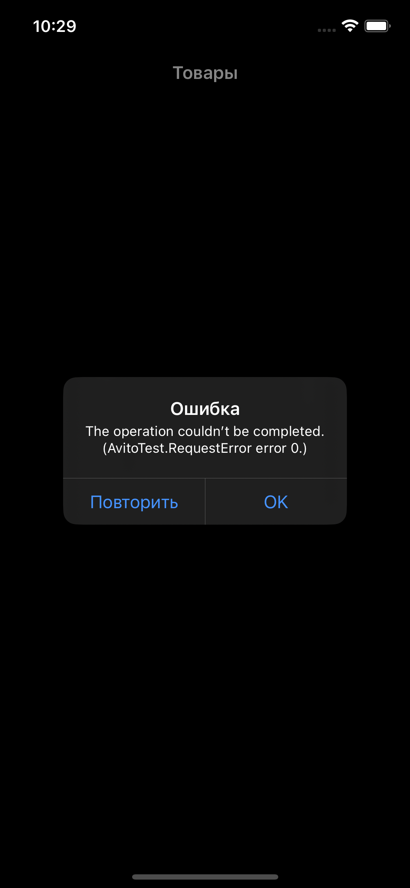

# Приложение "Avito Products Showcase"

Данное iOS-приложение разработано в рамках задания для создания экранов списка товаров и детальной карточки товара с использованием языка Swift и нативных iOS технологий. Приложение предоставляет удобный способ просматривать список товаров и получать подробную информацию о каждом товаре.

## Описание

Приложение состоит из двух основных экранов: список товаров и детальная карточка товара.

## Экран списка товаров

На этом экране пользователь видит список товаров, загруженных из JSON-файла, доступного по следующему URL: main-page.json. Экран имеет три состояния:

Отображение ошибки: Если загрузка данных не удалась по какой-либо причине, пользователь увидит сообщение об ошибке с возможностью повторной попытки загрузки.
Состояние загрузки: Во время загрузки данных будет показан индикатор загрузки, чтобы пользователь знал, что приложение активно работает.
Отображение контента: После успешной загрузки данных пользователь увидит список товаров, отображаемых в формате сетки с двумя столбцами.

## Экран детальной карточки товара

При нажатии на товар из списка откроется экран с детальной информацией о товаре. Детали загружаются из JSON-файла, доступного по URL вида: https://www.avito.st/s/interns-ios/details/{itemId}.json, где itemId - это идентификатор товара. Экран также имеет три состояния: ошибку, состояние загрузки и отображение контента.

## Скриншоты

### Экран списка товаров

Light Theme            |  Dark Theme
:-------------------------:|:-------------------------:
  |  

### Экран детальной карточки товара

Light Theme            |  Dark Theme
:-------------------------:|:-------------------------:
  |  

### Состояние экранов

Экран ошибка            |  Экран загрузки
:-------------------------:|:-------------------------:
  |  

## Технические детали

Для реализации данного приложения использовались следующие технологии и подходы:

Язык программирования: Swift
Интерфейс: Создание пользовательского интерфейса осуществлен через код без использования SwiftUI.
Список товаров: Для отображения списка товаров используется UICollectionView с отображением в два столбца.
Загрузка данных: Данные загружаются с использованием URLSession.
Обработка состояний: Для управления состояниями экранов (загрузка, ошибка, контент) применяется подход с использованием различных view и состояний в зависимости от процесса загрузки данных.

## Установка и запуск

1. Склонируйте репозиторий с GitHub: 
2. Откройте проект в Xcode.
3. Запустите симулятор или подключите устройство и выберите его в качестве целевого устройства.
4. Нажмите кнопку "Run" в Xcode для сборки и запуска приложения.

---
